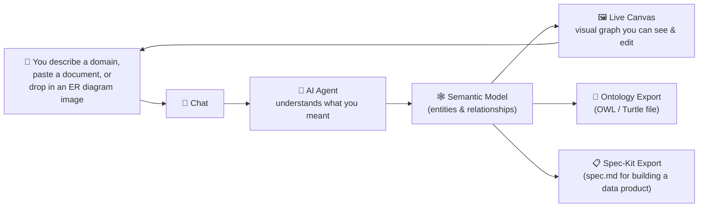
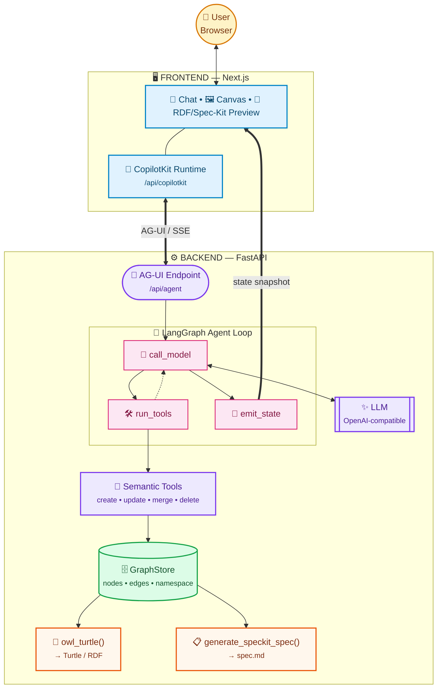

# VibeGraph Architecture Diagrams

Two diagrams for demo presentations: a simple story for non-technical audiences, and a detailed technical component diagram.

## 1. Big-picture story (for everyone)

**Narrative for the room:** *"You talk to it like a colleague — type, paste, or drop in a picture of a whiteboard diagram. It builds a shared semantic model live on screen. When you're happy, you export it either as a formal ontology, or as a specification an engineering team's AI coding agent can build a real data product from."*

## 2. Technical component diagram (backup slide)

Key visual choices:
- **Color per layer**: amber = user, blue = frontend, purple = backend/agent, pink = the model/tool loop, green = the single source-of-truth store, orange = the two exportable outputs.
- **Shape per role**: rounded pill for entry points, hexagon for the LLM, cylinder for the store — makes the diagram scannable even without reading labels closely.
- **Line style**: dashed for the internal `run_tools → call_model` loop-back, thick double lines (`==>`) for the two "big" cross-boundary hops (AG-UI transport, state snapshot back to the UI), thin lines for internal wiring.
